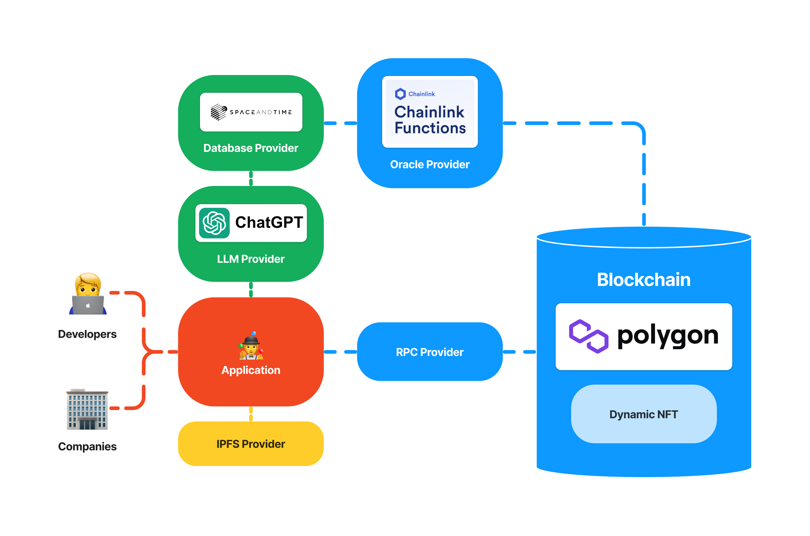

# 🤹 C'mon, AI, check my skills

Check your skills with AI interviewers and earn experience points for your resume.

## 🔗 Application

https://ai-interviewer-app.vercel.app/

## ✨ Inspiration

The number of developers is growing every day.

Because of this, companies need more and more resources and time to check their skills before hiring them.

To help developers find job more easily, and to help companies find the right people faster, we decided to create the AI Interviewer.

## 🔥 What it does

1. First, developer needs to create a profile.
2. After that, he can start an interview with any AI interviewer (JavaScript, Solidity, etc).
3. For each correct answer the user receives one experience point.
4. All resumes and earned experience points are displayed on the account page, which the developer can send to the company where he wants to get the job.
5. On the other hand, any company can open the app and see all the users, their interviews, results, and answers. If they are interested in a person, they can always contact them and offer a job.

## ⚒️ How we built it

- Chainlink Functions are used to load data from Space and Time database via API and display it in a dynamic NFT with interviews.
- Space and Time is used as a database that stores and aggregate messages generated during interviews between users and AI interviewers.
- ChatGPT is used as an engine for AI interviewers.
- Polygon is used as a blockchain for smart contracts with interviews and profiles.

## 🗻 Challenges we ran into

- It was a challenge to process the data generated by ChatGPT in a smart contract with dynamic NFT. But Chainlink Functions and Space and Time helped to solve this problem.

## 💪 Accomplishments that we're proud of

- We are proud that we were able to integrate ChatGPT and smart contract with dynamic NFT.

## 🧠 What we learned

- We learned how to integrate any web2 solution into a smart contract using Chainlink Functions and Space and Time database.

## 🚀 What's next for the project

There are many ideas on how to improve this project.

It would be great to:

- Add more interviewers.
- Add code checking with the ChatGPT plugin.
- Make collaborations with schools for developers.
- Attract companies that need programmers.

## 📃 Artifacts

- Interview сontract (Polygon Mumbai) - [0xE563878Fd405266E7000c60eF6d5081b56dDce30](https://mumbai.polygonscan.com/address/0xE563878Fd405266E7000c60eF6d5081b56dDce30)
- Profile сontract (Polygon Mumbai) - [0x735949074170D6ECB1d2fe5Ee90b5dd002A2330a](https://mumbai.polygonscan.com/address/0x735949074170D6ECB1d2fe5Ee90b5dd002A2330a)
- Table with interview messages (Space and Time) - `SANDBOX.INTERVIEW_MESSAGES`

## 🏗️ Architecture

